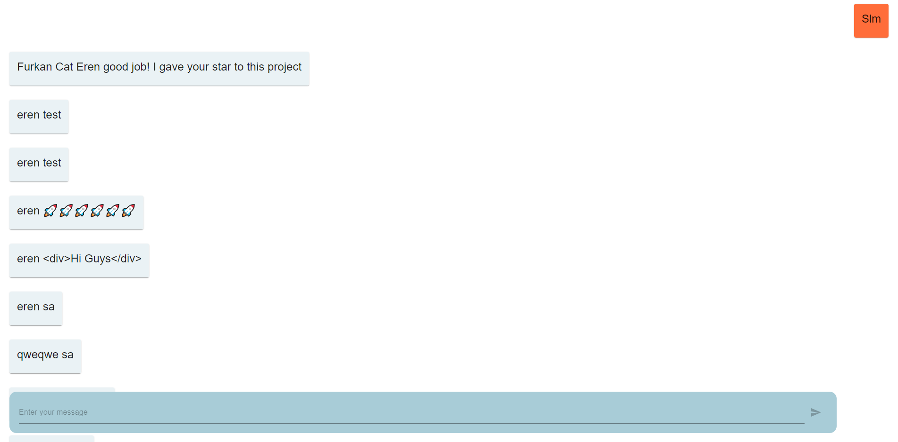

<h1 align="center">
  
   
  Messenger Clone Built Using React.JS & Firebase
</h1>

  This is a Messenger clone and it lets you chat with other users realtime!
     
  <strong><em>Here is the live version:</em></strong> https://messenger-cl-4e219.web.app/

  
# Home Page  
  

